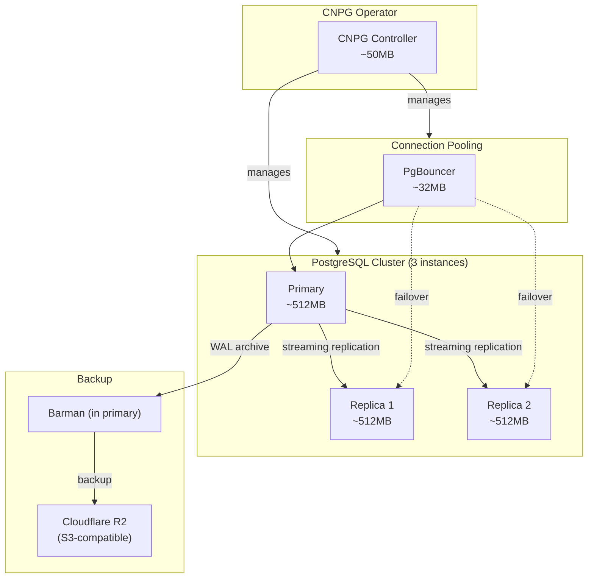
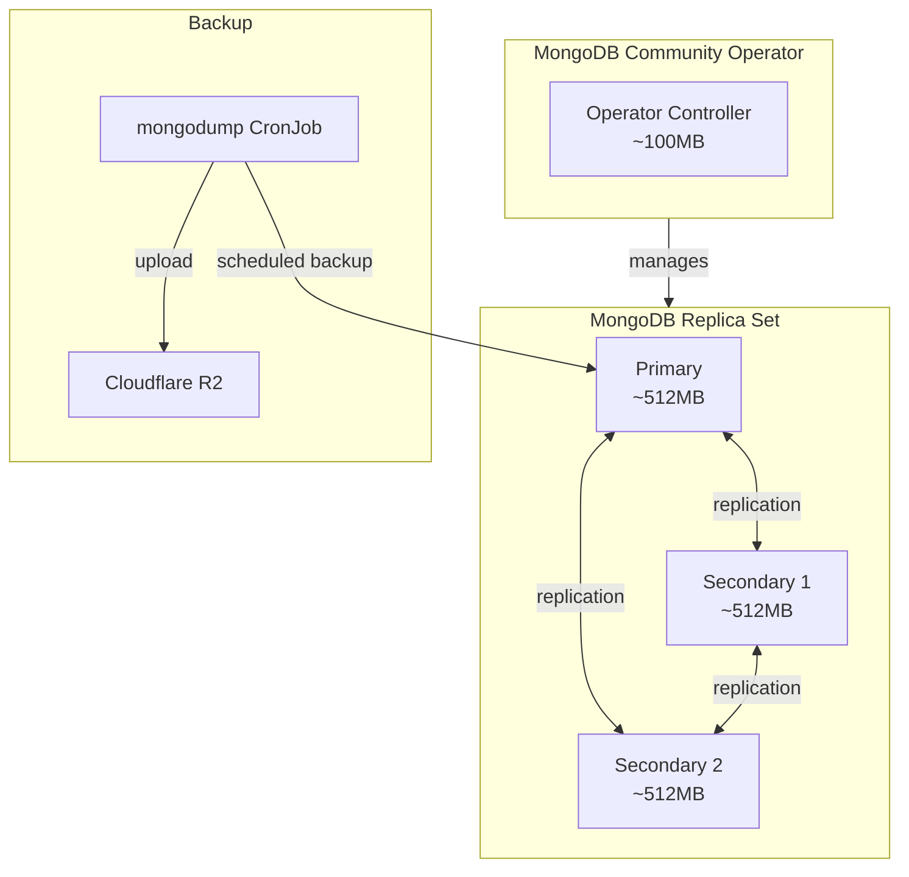

# ADR-021: Database Operators - CNPG and MongoDB Community

## Status
**Accepted**

## Date
2026-01-07

## Context

Talent Mesh requires managed PostgreSQL and MongoDB deployments with:
- High availability (automatic failover)
- Automated backups
- Connection pooling
- Declarative configuration (GitOps-friendly)

Options considered:

1. **Plain StatefulSets**: Manual management of replication and failover
2. **Kubernetes Operators**: Automated lifecycle management
3. **Managed cloud databases**: External services (not self-hosted)

## Decision

We will use **Kubernetes Operators** for database management:

- **PostgreSQL**: CloudNativePG (CNPG)
- **MongoDB**: MongoDB Community Kubernetes Operator

### Why Operators Over StatefulSets

| Factor | Plain StatefulSets | Operators |
|--------|-------------------|-----------|
| **Failover** | Manual intervention | **Automatic** |
| **Backups** | Manual scripting | **Built-in scheduling** |
| **Upgrades** | Risky, manual | **Rolling upgrades** |
| **Connection pooling** | Separate deployment | **Built-in (PgBouncer)** |
| **Monitoring** | Manual setup | **Prometheus metrics** |
| **GitOps** | Complex YAML | **Single CRD** |

---

## PostgreSQL: CloudNativePG (CNPG)

### Why CNPG

| Factor | CNPG | Zalando Postgres Operator | CrunchyData PGO |
|--------|------|---------------------------|-----------------|
| **License** | Apache 2.0 | MIT | Apache 2.0 |
| **Architecture** | Primary + replicas | Patroni-based | Primary + replicas |
| **Memory overhead** | **Low (~50MB operator)** | Higher | Higher |
| **Backup to S3** | ✅ Native (Barman) | ✅ | ✅ |
| **Connection pooling** | ✅ PgBouncer built-in | ✅ | ✅ |
| **CNCF** | ✅ Sandbox project | ❌ | ❌ |
| **Complexity** | **Simple** | More complex | More complex |

### CNPG Architecture



### CNPG Cluster Configuration

```yaml
apiVersion: postgresql.cnpg.io/v1
kind: Cluster
metadata:
  name: postgres-cluster
  namespace: databases
spec:
  instances: 3  # Primary + 2 replicas (minimum 3 for HA with VPA)

  # PostgreSQL configuration
  postgresql:
    parameters:
      max_connections: "200"
      shared_buffers: "256MB"
      effective_cache_size: "512MB"
      work_mem: "4MB"

  # Resource limits
  resources:
    requests:
      memory: "512Mi"
      cpu: "250m"
    limits:
      memory: "1Gi"
      cpu: "1000m"

  # Storage
  storage:
    size: 20Gi
    storageClass: local-path

  # Backup to Cloudflare R2
  backup:
    barmanObjectStore:
      destinationPath: s3://talent-mesh-backups/postgres
      endpointURL: https://<account-id>.r2.cloudflarestorage.com
      s3Credentials:
        accessKeyId:
          name: r2-credentials
          key: ACCESS_KEY_ID
        secretAccessKey:
          name: r2-credentials
          key: SECRET_ACCESS_KEY
    retentionPolicy: "30d"

  # Connection pooling
  enablePgBouncer: true
  pgBouncer:
    poolMode: transaction
    defaultPoolSize: 20
```

### CNPG Resource Requirements

| Component | Instances | Memory | CPU |
|-----------|-----------|--------|-----|
| CNPG Operator | 1 | ~50MB | 50m |
| PostgreSQL Primary | 1 | ~512MB | 250m |
| PostgreSQL Replica | 2 | ~1GB | 500m |
| PgBouncer | 1 | ~32MB | 20m |
| **Total** | | **~1.6GB** | ~820m |

---

## MongoDB: Community Kubernetes Operator

### Why MongoDB Community Operator

| Factor | Community Operator | Percona Operator | Manual ReplicaSet |
|--------|-------------------|------------------|-------------------|
| **License** | Apache 2.0 | Apache 2.0 | N/A |
| **Maintained by** | MongoDB Inc | Percona | Self |
| **Automation** | ✅ Full lifecycle | ✅ Full lifecycle | ❌ Manual |
| **Backup** | ✅ Scheduled | ✅ Scheduled | ❌ Manual |
| **Complexity** | **Simple** | More features | Complex |
| **Enterprise features** | ❌ | ✅ Some | ❌ |

### MongoDB Architecture



### MongoDB ReplicaSet Configuration

```yaml
apiVersion: mongodbcommunity.mongodb.com/v1
kind: MongoDBCommunity
metadata:
  name: mongodb-cluster
  namespace: databases
spec:
  members: 3  # 3-node replica set
  type: ReplicaSet
  version: "7.0.5"

  security:
    authentication:
      modes: ["SCRAM"]

  users:
    - name: app-user
      db: admin
      passwordSecretRef:
        name: mongodb-password
      roles:
        - name: readWrite
          db: talentmesh
      scramCredentialsSecretName: mongodb-scram

  statefulSet:
    spec:
      template:
        spec:
          containers:
            - name: mongod
              resources:
                requests:
                  memory: "512Mi"
                  cpu: "250m"
                limits:
                  memory: "1Gi"
                  cpu: "500m"
      volumeClaimTemplates:
        - metadata:
            name: data-volume
          spec:
            accessModes: ["ReadWriteOnce"]
            resources:
              requests:
                storage: 20Gi
            storageClass: local-path
```

### MongoDB Backup CronJob

```yaml
apiVersion: batch/v1
kind: CronJob
metadata:
  name: mongodb-backup
  namespace: databases
spec:
  schedule: "0 2 * * *"  # Daily at 2 AM
  jobTemplate:
    spec:
      template:
        spec:
          containers:
          - name: backup
            image: mongo:7.0
            command:
            - /bin/sh
            - -c
            - |
              mongodump --uri="$MONGO_URI" --archive=/backup/dump.gz --gzip
              mc cp /backup/dump.gz r2/talent-mesh-backups/mongodb/$(date +%Y%m%d).gz
            env:
            - name: MONGO_URI
              valueFrom:
                secretKeyRef:
                  name: mongodb-connection
                  key: uri
          restartPolicy: OnFailure
```

### MongoDB Resource Requirements

| Component | Instances | Memory | CPU |
|-----------|-----------|--------|-----|
| MongoDB Operator | 1 | ~100MB | 100m |
| MongoDB Primary | 1 | ~512MB | 250m |
| MongoDB Secondary | 2 | ~512MB each | 250m each |
| **Total** | | **~1.6GB** | ~850m |

---

## Combined Database Resource Budget

| Database | Component | Memory | CPU |
|----------|-----------|--------|-----|
| **PostgreSQL** | CNPG Operator | ~50MB | 50m |
| | Primary | ~512MB | 250m |
| | Replica | ~512MB | 250m |
| | PgBouncer | ~32MB | 20m |
| **MongoDB** | Operator | ~100MB | 100m |
| | Primary | ~512MB | 250m |
| | Secondary × 2 | ~1GB | 500m |
| **TOTAL** | | **~2.7GB** | ~1.4 cores |

## Consequences

### Positive

1. **Automated failover**: No manual intervention needed
2. **Declarative**: GitOps-friendly CRD definitions
3. **Integrated backups**: Scheduled backups to Cloudflare R2
4. **Connection pooling**: PgBouncer reduces connection overhead
5. **Monitoring**: Built-in Prometheus metrics
6. **Rolling upgrades**: Safe database version updates

### Negative

1. **Operator overhead**: ~150MB for operator pods
2. **Learning curve**: CRD syntax differs from raw StatefulSets
3. **Operator updates**: Must track operator releases

### Mitigations

- Use Flux to manage operator Helm releases
- Monitor operator health with Prometheus alerts
- Test upgrades in staging environment first

## References

- [CloudNativePG Documentation](https://cloudnative-pg.io/documentation/)
- [MongoDB Community Kubernetes Operator](https://github.com/mongodb/mongodb-kubernetes-operator)
- [CNPG Backup and Recovery](https://cloudnative-pg.io/documentation/current/backup_recovery/)
- [ADR-023: Backup Strategy - Cloudflare R2](./ADR-023-BACKUP-CLOUDFLARE-R2.md)

---

*ADR Version: 1.0*
*Last Updated: 2026-01-07*
