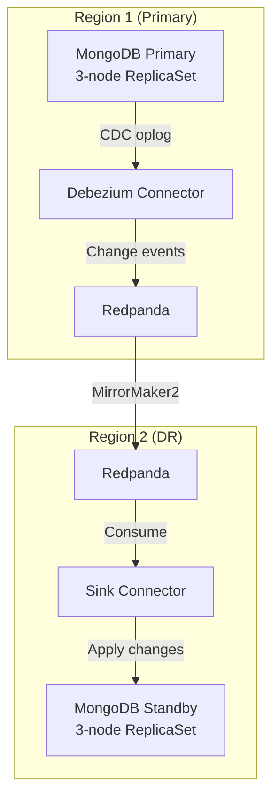
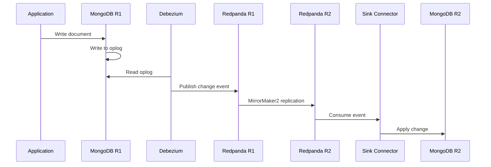

# ADR: MongoDB with Community Operator

**Status:** Accepted
**Date:** 2024-04-01
**Updated:** 2026-01-16

## Context

Need document database for unstructured/flexible schema data with multi-region disaster recovery support.

**Key Challenge:** MongoDB Community Edition does NOT have native cross-cluster replication. Enterprise Edition has this feature, but we target Community for cost reasons.

## Decision

Use MongoDB Community Operator with CDC-based replication via Debezium + Redpanda for cross-region DR.

## Architecture



## Rationale

| Option | Pros | Cons |
|--------|------|------|
| Cloud DBaaS | Zero ops, native DR | Cost, vendor lock-in |
| Enterprise Operator | Native replication | License cost (~$10k+/year) |
| **Community + CDC** | Free, K8s-native | Complexity, eventual consistency | **Selected** |

**Key Decision Factors:**
- MongoDB Community is free (no license cost)
- CDC via Debezium is proven technology
- Redpanda already in stack for event streaming
- Truly independent clusters (not stretched replica set)

## Multi-Region Strategy

### Why CDC Instead of Native Replication?

MongoDB Community Edition limitations:
- Replica set members must be in same cluster
- No built-in cross-datacenter replication
- Cannot do stretched replica set across WAN

Our solution uses Change Data Capture (CDC):
1. **Debezium** captures MongoDB oplog changes
2. **Redpanda** transports changes between regions
3. **Sink Connector** applies changes to standby cluster

### Replication Flow



### Trade-offs

| Aspect | Impact |
|--------|--------|
| Consistency | Eventual (seconds to minutes lag) |
| Conflict handling | Last-write-wins or application logic |
| Failover | Manual promotion required |
| Complexity | Additional components (Debezium, connectors) |

## Features

| Feature | Support |
|---------|---------|
| Replica set | 3-node per cluster |
| Automatic failover | Within cluster only |
| Rolling updates | Per cluster |
| Authentication | SCRAM |
| TLS | cert-manager integration |
| Cross-region DR | Via CDC (Debezium + Redpanda) |

## Configuration

### MongoDB Cluster

```yaml
apiVersion: mongodbcommunity.mongodb.com/v1
kind: MongoDBCommunity
metadata:
  name: <tenant>-mongodb
  namespace: databases
spec:
  members: 3
  type: ReplicaSet
  version: "7.0.5"
  security:
    authentication:
      modes: ["SCRAM"]
  users:
    - name: <tenant>-user
      db: admin
      passwordSecretRef:
        name: <tenant>-mongodb-password
      roles:
        - name: readWrite
          db: <tenant>
```

### Debezium Source Connector

```yaml
apiVersion: kafka.strimzi.io/v1beta2
kind: KafkaConnector
metadata:
  name: mongodb-source
  labels:
    strimzi.io/cluster: debezium-connect
spec:
  class: io.debezium.connector.mongodb.MongoDbConnector
  tasksMax: 1
  config:
    mongodb.connection.string: mongodb://<tenant>-mongodb-svc:27017
    mongodb.user: debezium
    mongodb.password: ${secrets:databases/<tenant>-debezium-password:password}
    topic.prefix: <tenant>.mongodb
    database.include.list: <tenant>
    capture.mode: change_streams_update_full
```

### MongoDB Sink Connector (DR Region)

```yaml
apiVersion: kafka.strimzi.io/v1beta2
kind: KafkaConnector
metadata:
  name: mongodb-sink
  labels:
    strimzi.io/cluster: debezium-connect
spec:
  class: com.mongodb.kafka.connect.MongoSinkConnector
  tasksMax: 1
  config:
    connection.uri: mongodb://<tenant>-mongodb-svc:27017
    database: <tenant>
    topics: <tenant>.mongodb.*
    change.data.capture.handler: com.mongodb.kafka.connect.sink.cdc.debezium.rdbms.RdbmsHandler
```

## Failover Procedure

1. **Detect failure** - Monitoring alerts on Region 1 unavailability
2. **Stop replication** - Disable Debezium connector
3. **Verify data** - Check last applied change in Region 2
4. **Promote standby** - Application configuration points to Region 2
5. **Resume writes** - Region 2 becomes new primary
6. **Reverse replication** - When Region 1 recovers, set up CDC in reverse

## Consequences

**Positive:**
- No MongoDB Enterprise license cost
- Truly independent clusters (survive network partition)
- Reuses Redpanda already in stack
- K8s-native with GitOps management

**Negative:**
- Eventual consistency (not suitable for strong consistency requirements)
- Additional operational complexity (Debezium, connectors)
- Manual failover process
- Conflict resolution needed for active-active

## When NOT to Use This

Consider alternatives if:
- **Strong consistency required** - Use PostgreSQL (CNPG) instead
- **Active-active writes needed** - Consider CockroachDB or managed MongoDB Atlas
- **Simplicity priority** - Use cloud-managed MongoDB

## Related

- [ADR-EVENT-STREAMING-REDPANDA](../../redpanda/docs/ADR-EVENT-STREAMING-REDPANDA.md)
- [ADR-MULTI-REGION-STRATEGY](../../handbook/docs/adrs/ADR-MULTI-REGION-STRATEGY.md)
- [RUNBOOK-MONGODB-FAILOVER](./RUNBOOK-MONGODB-FAILOVER.md)
